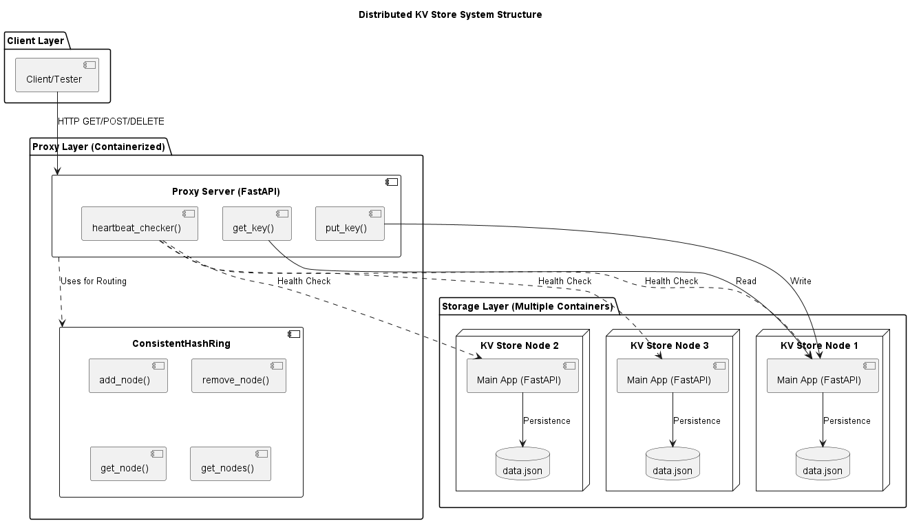
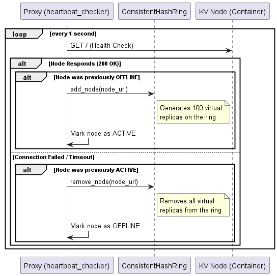
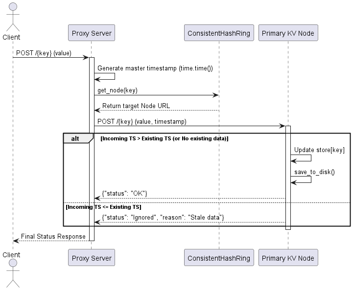
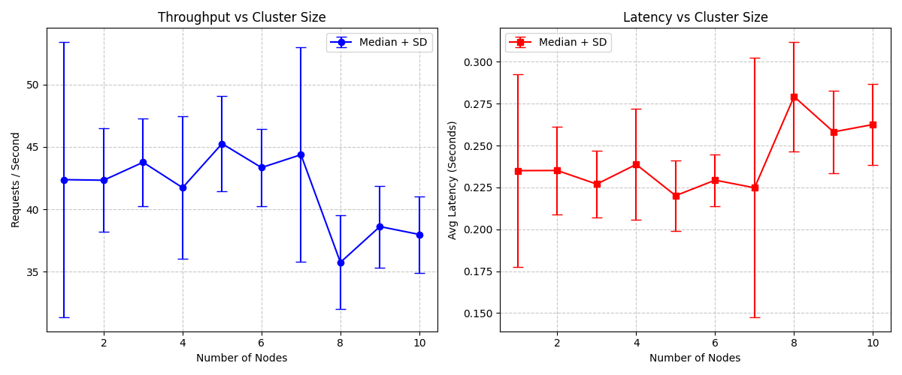

# Distributed Key-Value Store with Consistent Hashing

This project implements a scalable and fault-tolerant distributed Key-Value (KV) store. It uses **Consistent Hashing** to distribute data across multiple containerized nodes and features a central Proxy that handles request routing, health monitoring, and conflict resolution.

---

## 1. System Architecture

<p align="center">
  
</p>

<p align="center">
  
</p>
The system consists of two primary layers:

1.  **Proxy Layer**: Acts as the entry point for all client requests. It manages the `ConsistentHashRing`, performs continuous heartbeats on storage nodes, and coordinates read/write operations.

2.  **Storage Layer (Nodes)**: Lightweight FastAPI applications encapsulated in Docker containers. Each node maintains its own local persistence via `data.json` and follows a Last-Write-Wins (LWW) update policy.


---

## 2. Key Features

* **Consistent Hashing**: Dynamically maps keys to nodes using MD5 hashing and virtual replicas to ensure even load distribution and minimize data migration during scaling.
* **Dynamic Topology**: A `heartbeat_checker` in the proxy automatically detects when nodes go offline or come back online, updating the hash ring in real-time to keep the system operational.
* **Automated Orchestration**: A `controller.py` script automates the generation of `docker-compose.yml` and manages the lifecycle of the containerized cluster.
* **Performance Benchmarking**: Includes a suite to measure throughput and latency as the cluster scales from 1 to 10 nodes (can be editted).
* **Conflict Resolution**: Implements a **Last-Write-Wins (LWW)** strategy using master timestamps generated by the proxy to ensure data consistency during concurrent operations.
<p align="center">
  
</p>

---

## 3. Getting Started

### Prerequisites
* Python 3.12+
* Docker and Docker Compose
* Python packages: `httpx`, `fastapi`, `uvicorn`, `requests`, `matplotlib`, `pyyaml`

### Running the Cluster
Use the `controller.py` script to manage the distributed system:

* **Start a cluster (e.g., 3 nodes):**
    ```bash
    python3 controller.py 1 3
    ```
    *Note: Add the `-f` flag for a "fresh" start to wipe existing data directories and volumes.*

* **Shutdown the cluster:**
    ```bash
    python3 controller.py 2
    ```

---

## 4. Testing & Performance Evaluation

The `scaling_wr_test.py` script automates the performance evaluation by incrementally scaling the cluster and measuring system metrics.

**To run the benchmarks:**
```bash
python3 scaling_wr_test.py
```

The result will show the overall plot of throughput and latency.
<p align="center">
  
</p>