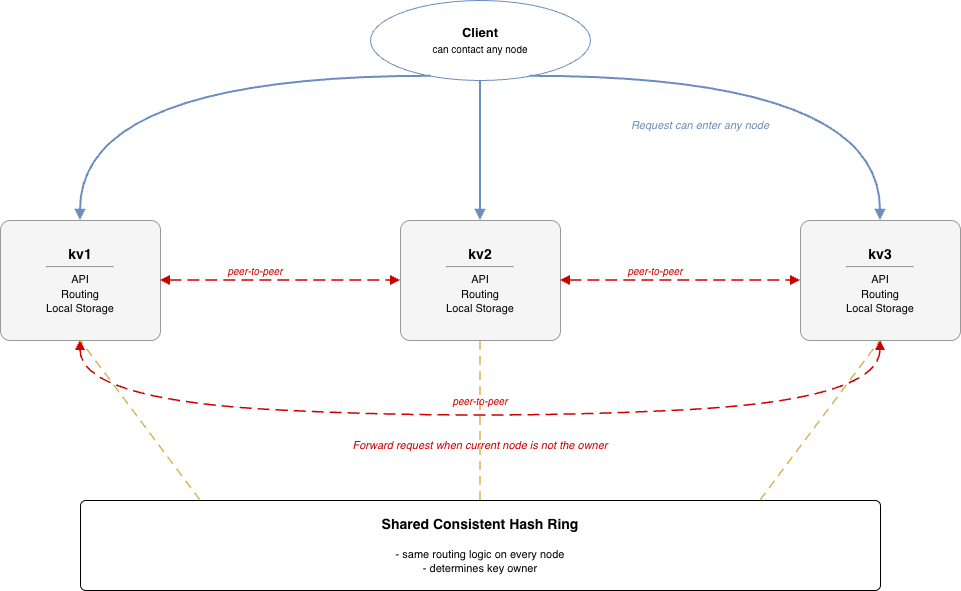
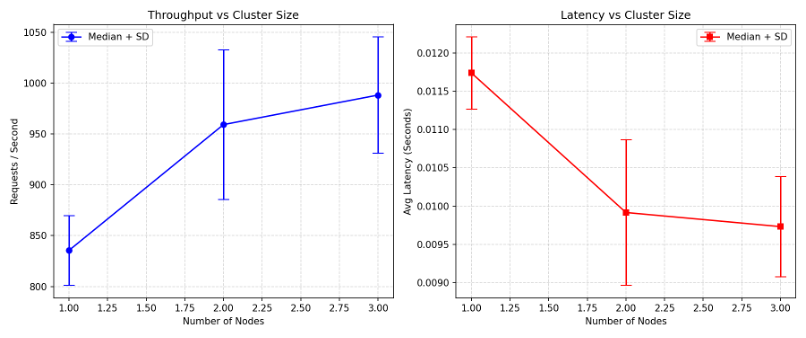

# Cloud Computing Coding Assignment 2

## System Overview

This project implements a distributed KV store with consistent hashing, embedded proxy forwarding, and Docker Compose based scaling.



## How To Test (1 -> 3 nodes)

Build image once:

```bash
docker compose build
```

#### 1 node
```bash
NODES_LIST="http://kv1:8080" docker compose up -d kv1
python benchmark.py --entry-nodes 1 --runs 10 --timeout 5 --workers 6
docker compose down
```

#### 2 nodes
```bash
NODES_LIST="http://kv1:8080,http://kv2:8080" docker compose up -d kv1 kv2
python benchmark.py --entry-nodes 2 --runs 10 --timeout 5 --workers 6
docker compose down
```

#### 3 nodes
```bash
NODES_LIST="http://kv1:8080,http://kv2:8080,http://kv3:8080" docker compose up -d kv1 kv2 kv3
python benchmark.py --entry-nodes 3 --runs 10 --timeout 5 --workers 6
docker compose down
```

Optional clean run:

```bash
docker compose down -v
```

## Node Change Check

This project includes node-change checking for dynamic mode.

1. Start with dynamic config:

```bash
docker compose -f docker-compose.yml -f docker-compose.dynamic.yml up -d kv1 kv2 kv3
```

2. Check current node view:

```bash
curl http://127.0.0.1:8081/cluster/nodes
```

3. Update `nodes.json`, wait a few seconds, and call the same endpoint again.

If the `nodes` field changes in the response, node-change detection is working.

## What This Assignment Implements

1. Consistent hashing ring for key-to-node mapping.
2. Embedded proxy routing in each KV node (forward to owner node when needed).
3. Containerized deployment with 1/2/3 node scale testing via docker compose.
4. Benchmark script for throughput and latency measurement.
5. Optional dynamic node list refresh (watch `nodes.json` and rebuild ring at runtime).

## Notes

1. Current dynamic mode updates routing immediately, but does not auto-migrate old data.
2. `GET /cluster/nodes` can be used to inspect current node view and refresh settings.
3. This implementation currently has no replication. Each key has a single owner node, so node failures can cause temporary data unavailability.

<!-- ### Benchmark script flags

- `--entry-nodes`: number of running KV nodes. The script builds a consistent hash routing table and prints the mapping (e.g., `kv1 -> http://127.0.0.1:8081`).
- `--base-port`: host port for `kv1` (default 8081). Change it only if Docker ports differ.
- `--virtual-nodes`: default 50 so the client ring mirrors the server configuration. -->

## Plot Script (1 -> 3 Nodes)

Run the automated 1→N benchmark loop and export throughput/latency plots plus raw JSON:

```bash
python benchmark_cluster_plot.py --max-nodes 3
```

Outputs:
- `benchmark_nodes_1_to_3.png`
- `benchmark_nodes_1_to_3.json`

Benchmark outcome example:


